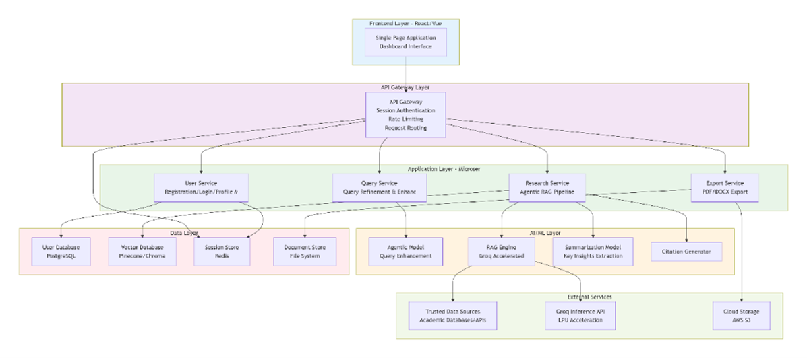
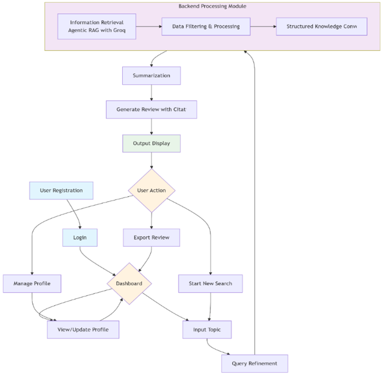

<p align="center">
  
</p>

# Agentic RAG-Powered Research Assistant for Academia


## AI-powered Academic Literature Discovery using Agentic Retrieval-Augmented Generation

---

# Overview

This project presents the design and implementation of an **Agentic Retrieval-Augmented Generation (RAG) system** designed to assist academic research workflows.

The platform integrates **semantic document retrieval**, **vector databases**, and **large language model inference** to automatically discover, process, and summarize academic literature.

The system retrieves research papers from **arXiv**, converts them into **semantic embeddings**, stores them in a **vector database**, and enables **context-grounded responses** using a **Groq-powered language model**.

The architecture combines:

- **React frontend**
- **Django backend**
- **AI processing layer implementing an Agentic RAG pipeline**

This project was developed as a **Final Year B.Tech Project in Computer Science and Engineering**.

---

# Key Features

- Academic paper retrieval from **arXiv**
- Semantic search using **vector embeddings**
- **Agentic Retrieval-Augmented Generation pipeline**
- AI-generated **structured summaries**
- **Document-based question answering**
- Context-grounded responses from retrieved papers
- Vector database integration (**FAISS & ChromaDB**)
- **Groq LLM inference** for fast response generation
- User authentication and dashboard interface
- Web-based academic research assistant platform

---

# System Architecture

The system follows a **three-layer architecture** separating:

- User Interaction
- Application Logic
- AI Processing

<p align="center">

</p>

## Architecture Flow

```
Client Layer
    ↓
React Web Application
    ↓
Backend API (Django)
    ↓
AI Processing Layer
    ↓
LangChain Agentic RAG Pipeline
    ↓
Vector Databases (FAISS / ChromaDB)
    ↓
Groq Large Language Model
```

---

# System Workflow

The research pipeline implemented in this system follows the workflow below:

1. User logs into the platform  
2. User enters a research topic  
3. Backend retrieves academic papers from **arXiv**  
4. Retrieved papers are processed and structured  
5. Documents are converted into **semantic embeddings**  
6. Embeddings are stored in a **vector database**  
7. A semantic retriever selects relevant document chunks  
8. An **agent-based controller invokes the LLM**  
9. The LLM generates a **grounded academic summary**  
10. The response is displayed to the user  

<p align="center">

</p>

---

# Technology Stack

## Frontend

- React
- Vite
- JavaScript
- CSS
- Axios

## Backend

- Django
- Python
- SQLite (development database)

## AI / Machine Learning

- LangChain
- HuggingFace Sentence Transformers
- FAISS
- ChromaDB
- Groq LLM
- arXiv API
- CrossRef Metadata API

---

# Project Structure

```text
Agentic-RAG-Powered-Research-Assistant-for-Academia
│
├── backend
│   └── api
│       ├── app
│       │   ├── main_part.py
│       │   ├── models.py
│       │   ├── views.py
│       │   ├── urls.py
│       │   └── migrations
│       │
│       ├── manage.py
│       ├── requirements.txt
│       └── main.json
│
├── frontend
│   ├── public
│   ├── src
│   │   ├── assets
│   │   ├── components
│   │   ├── context
│   │   ├── css
│   │   ├── App.jsx
│   │   └── main.jsx
│   │
│   ├── package.json
│   └── vite.config.js
│
├── docs
│   ├── system_architecture.png
│   ├── workflow_pipeline.png
│   └── Project Report Results and Findings.pdf
│
├── screenshots
│   ├── login_page.png
│   ├── dashboard.png
│   ├── research_search.png
│   └── generated_summary.png
│
├── .gitignore
└── README.md
```

---

# Running the Project

## Backend Setup

Navigate to backend directory

```
cd backend/api
```

Install dependencies

```
pip install -r requirements.txt
```

Apply migrations

```
python manage.py migrate
```

Start Django server

```
python manage.py runserver
```

Backend runs at:

```
http://127.0.0.1:8000
```

---

## Frontend Setup

Navigate to frontend directory

```
cd frontend
```

Install dependencies

```
npm install
```

Run development server

```
npm run dev
```

Frontend runs at:

```
http://localhost:5173
```

---

# Screenshots

## Login Interface


## Dashboard


## Research Paper Search


## AI Generated Summary


## Genearte Citation


---

# Current Scope

- arXiv is used as the **primary academic data source**
- System processes **text-based research papers**
- AI models are used in **inference-only mode**
- Vector storage implemented locally
- Designed to assist **academic literature exploration**

---

# Future Work

- Integration with **Semantic Scholar** and **IEEE**
- Citation formatting support (**APA / IEEE / MLA**)
- Multi-agent research pipelines
- Quantitative evaluation metrics
- Cloud deployment and scaling
- Collaborative research features

---

# Academic Context

This system was developed as a **Final Year B.Tech Thesis Project** in **Computer Science and Engineering**.

The project demonstrates practical implementation of:

- Retrieval-Augmented Generation
- Agent-based orchestration
- Semantic search using vector databases
- AI-assisted academic research systems

---

# Author

**Basharat Hassan**  
Bachelor of Technology — Computer Science and Engineering  
Sharda University
